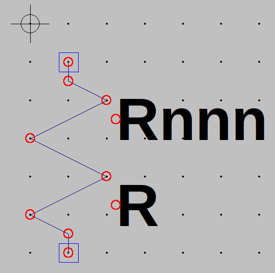
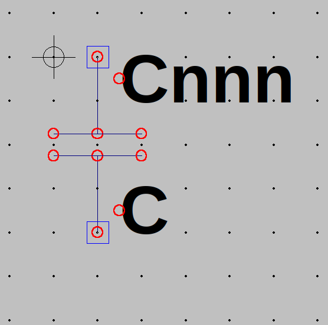
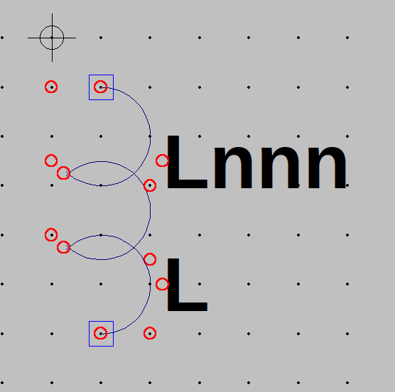
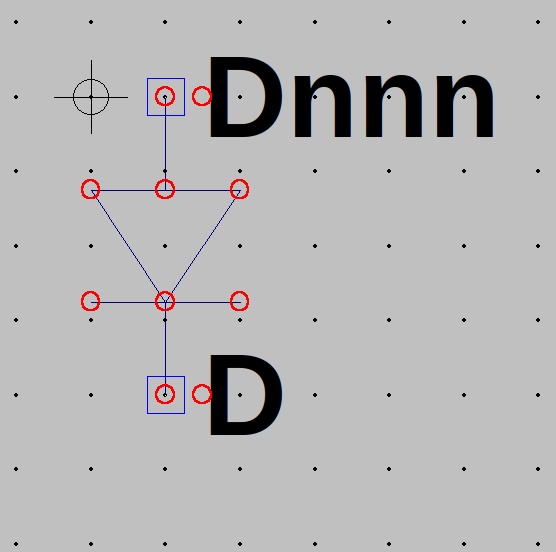
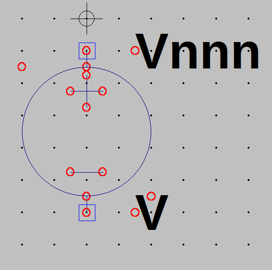

# Components spice models:

Grid: 16

## Resistance

Length: 96

Offsets for wiring:

@ 0 deg
* +16 x
* +16 y

@ 90 deg
* -16 x
* +16 y

@ 180 deg
* -16 x
* -16 y

@ 270 deg
* +16 x
* -16 y

## Capacitor

Length: 64

Offsets for wiring:

@ 0 deg
* +16 x

@ 90 deg
* -16 x

@ 180 deg
* -16 x

@ 270 deg
* +16 x

## Inductance

Length: 112

Offsets for wiring:

@ 0 deg
* +16 x
* +16 y

@ 90 deg
* -16 x
* +16 y

@ 180 deg
* -16 x
* -16 y

@ 270 deg
* +16 x
* -16 y

## Diode

Length: 64

Offsets for wiring:

@ 0 deg
* +16 x

@ 90 deg
* -16 x

@ 180 deg
* -16 x

@ 270 deg
* +16 x

## Sources  

Length: 112

Offsets for wiring:

@ 0 deg
* +16 y

@ 90 deg
* -16 y

@ 180 deg
* -16 y

@ 270 deg
* +16 y